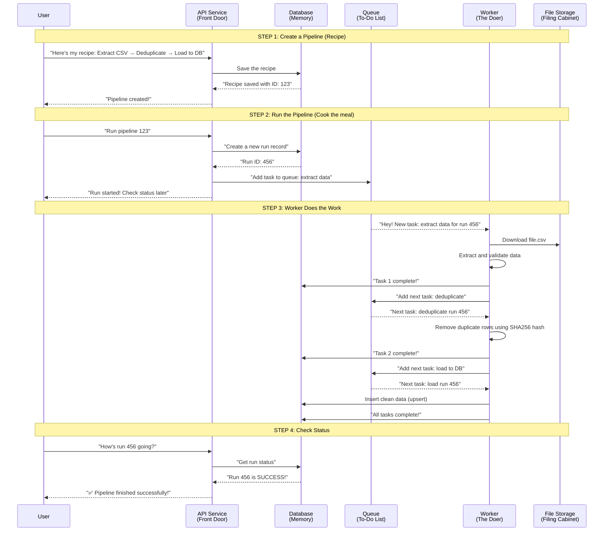
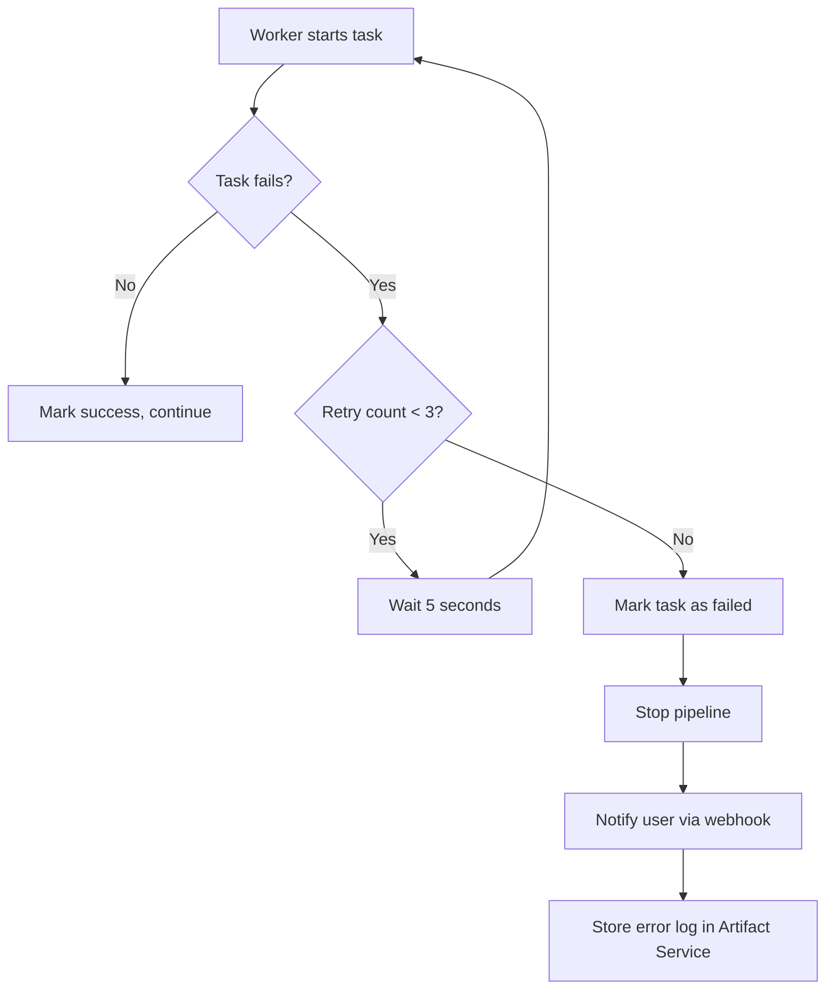
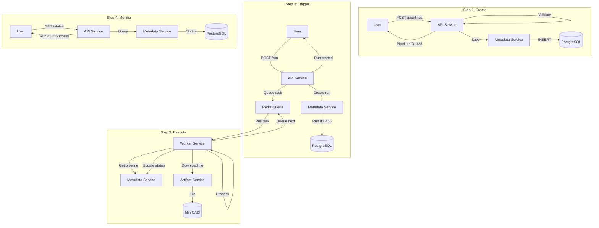

Absolutely! Let me explain how this entire system works in the **simplest way possible** - like you're explaining it to someone who's never built a pipeline system before.

---

## The Big Picture (In Plain English)

**Think of it like a restaurant kitchen:**

| Restaurant             | Your Pipeline System               |
| ---------------------- | ---------------------------------- |
| Customer orders food   | User triggers a pipeline           |
| Recipe (steps to cook) | Pipeline definition (steps to run) |
| Chef cooks one dish    | Worker executes one step           |
| Waiters coordinate     | API & Scheduler coordinate         |
| Plates with food       | Artifacts (files/data)             |
| Customer gets food     | Data loads to database             |

Just like a restaurant has multiple chefs working on different orders simultaneously, your system runs multiple pipelines in parallel.

---

## The Simplest Possible Flow

Here's what happens from **start to finish** when someone creates and runs a pipeline:



---

## The 5 Microservices Explained Simply

### **1. API Service - The Receptionist**

```
What it does: Answers the door and takes requests

Examples:
- "Create a new pipeline" → "Okay, here's your ID"
- "Run pipeline 123" → "Okay, I'll start it"
- "What's the status?" → "It's 50% done"

Think of it as: Hotel front desk
```

### **2. Scheduler Service - The Alarm Clock**

```
What it does: Starts pipelines automatically at specific times

Examples:
- "Run every day at 9 AM" → *BEEP BEEP* "Time to run!"
- "Run when webhook received" → "Someone knocked! Start!"

Think of it as: Your phone alarm + IFTTT
```

### **3. Worker Service - The Employee**

```
What it does: Actually does the work

Examples:
- Extract: "Go download this CSV file"
- Validate: "Check if all columns exist"
- Deduplicate: "Remove duplicate rows"
- Transform: "Change date format from DD/MM to MM/DD"
- Load: "Insert into database"

Think of it as: Restaurant chef / Factory worker
```

### **4. Metadata Service - The Librarian**

```
What it does: Keeps track of everything that happened

Stores:
- What pipelines exist
- When each run started/finished
- Whether each step succeeded or failed
- Who created what

Think of it as: Librarian with perfect memory
```

### **5. Artifact Service - The Storage Room**

```
What it does: Stores files

Examples of files:
- Uploaded CSV files
- Transformed data (Parquet)
- Error logs
- Rejected rows

Think of it as: Filing cabinet / Google Drive
```

---

## What Happens When You Create a Pipeline

Let me walk through a **real example**:

### Step 1: User sends this JSON to API Service

```json
{
  "name": "customer_sync",
  "steps": [
    {"id": "step1", "type": "extract_csv", "file": "customers.csv"},
    {"id": "step2", "type": "deduplicate", "field": "email"},
    {"id": "step3", "type": "load_postgres", "table": "customers"}
  ]
}
```

### Step 2: API Service validates and saves

```
API Service thinks:
"Let me check if this makes sense..."
✅ Step IDs are unique
✅ extract_csv comes before deduplicate
✅ No circular dependencies (A→B→A)
✅ All step types are supported

"Looks good! Saving to database..."
API → Metadata Service: "Save this pipeline"
Metadata Service → PostgreSQL: "INSERT INTO pipelines..."
PostgreSQL → Metadata Service: "Saved! ID: 123"
Metadata Service → API: "Pipeline 123 created"
API → User: "Pipeline created successfully!"
```

---

## What Happens When You Run a Pipeline

### Step 1: User triggers run

```
User: POST /pipelines/123/run
API Service: "Starting pipeline 123..."

API → Metadata Service: "Create run record"
Metadata Service → PostgreSQL: "INSERT INTO runs (status='pending')"
PostgreSQL → Metadata Service: "Run ID: 456"
Metadata Service → API: "Run 456 created"

API → Queue: "Add task: run 456, step 1 (extract_csv)"
Queue: "Added to to-do list"

API → User: "Run 456 started!"
```

### Step 2: Worker picks up the task

```
Worker: "Any tasks for me?"
Queue: "Yes! Run 456, step 1"
Worker: "I'll take it"

Worker → Metadata Service: "Task 1 status = 'running'"
Worker → Artifact Service: "Download customers.csv"
Artifact Service → Worker: "Here's the file"

Worker: "Extracting data..."
Worker: "Found 1000 rows"

Worker → Metadata Service: "Task 1 status = 'success'"
Worker → Queue: "Add next task: run 456, step 2 (deduplicate)"
```

### Step 3: Worker continues through steps

```
Worker: "Any more tasks?"
Queue: "Yes! Run 456, step 2"
Worker: "Doing deduplication..."

Worker: "Found 50 duplicate emails"
Worker: "Removed duplicates, 950 rows left"

Worker → Metadata Service: "Task 2 status = 'success'"
Worker → Queue: "Add next task: run 456, step 3 (load_postgres)"

Worker: "Any more tasks?"
Queue: "Yes! Run 456, step 3"
Worker: "Loading to database..."

Worker: "Upserting 950 rows into customers table"
Worker: "Done!"

Worker → Metadata Service: "Task 3 status = 'success'"
Worker → Metadata Service: "Run 456 status = 'completed'"
```

### Step 4: User checks status

```
User: GET /runs/456
API Service → Metadata Service: "Get run 456 status"
Metadata Service → API: "Run 456: SUCCESS, completed in 5.2 seconds"
API → User: {
  "run_id": 456,
  "status": "success",
  "duration": 5.2,
  "tasks": [
    {"step": "extract_csv", "status": "success", "rows": 1000},
    {"step": "deduplicate", "status": "success", "rows_after": 950},
    {"step": "load_postgres", "status": "success", "rows_loaded": 950}
  ]
}
```

---

## The Hash-Based ID System (For Deduplication)

This is **critical** for idempotency. Here's how it works:

### Problem: Without hash IDs

```
Run 1: Loads customer data → 1000 rows
Run 2 (retry): Loads customer data → 1000 rows (DUPLICATES!)
Result: 2000 rows, but only 1000 unique customers ❌
```

### Solution: With hash IDs

```python
# When loading, each row gets a unique hash based on its data
row_hash = sha256(customer_email + order_date + amount)

# Example:
row_hash = "a3f5c8e9..." for customer "john@email.com"

# Database upsert:
INSERT INTO customers (...) VALUES (...)
ON CONFLICT (row_hash) DO UPDATE  # Updates instead of duplicate
```

```
Run 1: Inserts 1000 rows (each with unique hash)
Run 2 (retry): Tries to insert same rows
Database: "Hash a3f5c8e9 already exists! Update instead of insert"
Result: Still 1000 rows, no duplicates ✅
```

---

## The Queue System (Why It's Needed)

### Without queue (everything in API):

```
API receives request → Starts extracting 1GB file
API is now busy for 5 minutes
Other users: "Hello? Anyone there?" ❌
```

### With queue (what you have):

```
API: "Here's the task, workers will handle it" (1 millisecond)
API: "Next user please!"
Worker in background: "I'll process that 1GB file slowly"
Other users: No waiting! ✅
```

---

## Complete User Journey Example

```
1. Morning: Data analyst creates a pipeline
   "I want to sync customer data every hour"
   → API Service saves the pipeline

2. 9:00 AM: Scheduler Service triggers run
   "Time to run the hourly sync!"
   → Adds task to queue

3. 9:00:01 AM: Worker Service starts
   "Downloading CSV from S3..."
   "Validating columns..."
   "Deduplicating by email..."
   "Loading to PostgreSQL..."

4. 9:00:30 AM: Worker finishes
   "Success! 500 new customers added"

5. Analyst checks dashboard
   "Last run: Success at 9:00 AM, 500 rows processed"

6. 10:00 AM: Scheduler triggers again
   "Another run..."
   (Repeat automatically!)
```

---

## What Happens When Something Fails?



**Example:**

```
API Service → PostgreSQL is down
Worker tries to load data → FAILED (retry 1)
Worker waits 5 seconds → FAILED (retry 2)
Worker waits 10 seconds → FAILED (retry 3)
Worker gives up → "Pipeline failed"
User gets email: "Your pipeline failed at 9:05 AM"
```

---

## One Complete Flow Diagram (All Services)



---

## In One Sentence Each

| Service                     | One Sentence                                       |
| --------------------------- | -------------------------------------------------- |
| **API Service**       | Receives requests and says "I'll handle that"      |
| **Scheduler Service** | Wakes up at the right time and says "Time to run!" |
| **Worker Service**    | Does the actual data processing work               |
| **Metadata Service**  | Remembers everything that happened                 |
| **Artifact Service**  | Stores all the files                               |

---

## Do You Want Me To...

1. **Show you the actual code** for one complete flow (e.g., extract → load)?
2. **Explain how to deploy** these 5 services on your computer?
3. **Draw a data flow diagram** showing how data moves between services?
4. **Explain error handling** in more detail (what breaks and how it recovers)?

Just let me know what you'd like to dive deeper into!
